# 💡 Node.js: Konzepte, Architektur und Ökosystem

Dieses Dokument bietet einen theoretischen Überblick über Node.js, seine Schlüsselkonzepte, Vergleiche mit anderen Technologien und beschreibt wichtige Aspekte wie Sicherheit und beliebte Bibliotheken.

## 📋 Inhaltsverzeichnis

1. [🎯 Was ist Node.js und warum brauchen wir es?](#what-is-nodejs)
2. [⚙️ Wie Node.js funktioniert: Schlüsselkonzepte](#how-it-works)
3. [📚 Ökosystem: Hauptmodule und Bibliotheken](#ecosystem)
4. [🛡️ Sicherheit: Verschlüsselung und Authentifizierung](#security)
5. [🚀 Node.js vs Konkurrenten: Deno und Bun](#comparison)
6. [🧪 Testen von Node.js-Anwendungen](#testing)
7. [🌟 Was gibt Node.js den Entwicklern?](#benefits)

---

## 🎯 Was ist Node.js und warum brauchen wir es? {#what-is-nodejs}

Node.js wurde 2009 von Ryan Dahl entwickelt. **Das Hauptziel** – JavaScript außerhalb des Browsers ausführen zu können, hauptsächlich zur Erstellung schneller und skalierbarer Serveranwendungen.

**Das Problem, das Node.js löste:** Traditionelle Webserver (z.B. Apache) erstellten für jede Anfrage einen neuen Thread, was sehr ressourcenintensiv und langsam bei vielen gleichzeitigen Verbindungen war. Node.js bot einen anderen Ansatz.

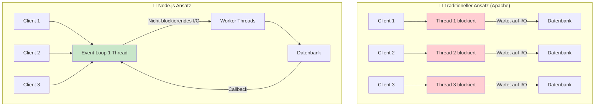

**Schlüsselidee:** Verwendung von **nicht-blockierendem, ereignisgesteuertem Ein-/Ausgabe (Non-blocking, Event-driven I/O)**. Anstatt auf die Fertigstellung einer langen Operation zu warten (z.B. Datei lesen oder Datenbankabfrage), übergibt Node.js diese Aufgabe an das System und verarbeitet weiter andere Anfragen. Wenn die Aufgabe abgeschlossen ist, benachrichtigt das System Node.js über ein Ereignis.

---

## ⚙️ Wie Node.js funktioniert: Schlüsselkonzepte {#how-it-works}

Im Kern von Node.js stehen zwei Technologien: die **V8**-Engine (von Google Chrome) und die **libuv**-Bibliothek.

- **V8 Engine**: Kompiliert und führt JavaScript aus.
- **libuv**: Bietet Event Loop und asynchrones I/O.

### Event Loop (Ereignisschleife)

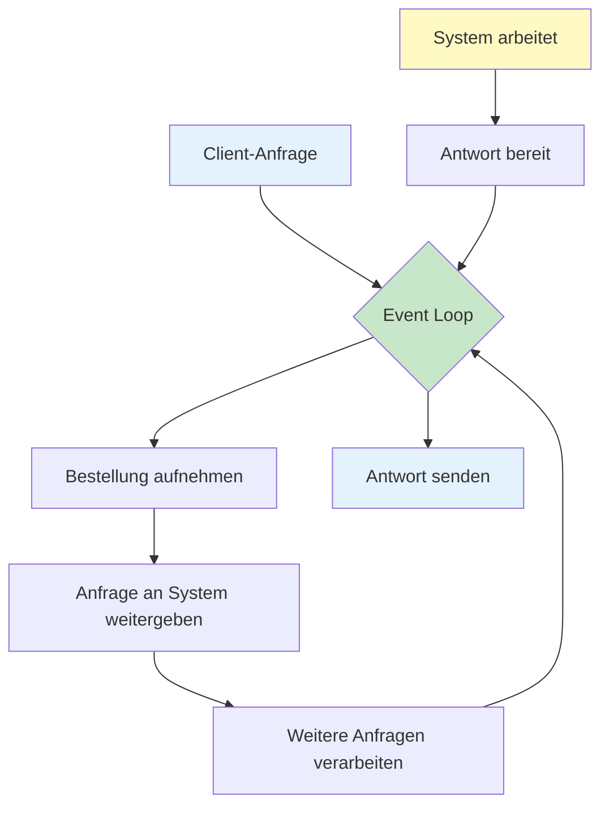

**Event Loop Regeln einfach erklärt**
Goldene Regeln:
📞 Callbacks warten auf ihre Reihenfolge
⚡ Promises werden direkt nach dem aktuellen Code ausgeführt
⏰ Timer können sich verzögern
📁 I/O-Operationen sind am langsamsten

---

## 📚 Ökosystem: Hauptmodule und Bibliotheken {#ecosystem}

Node.js hat eine mächtige Standardbibliothek und ein riesiges Ökosystem von Paketen (NPM).

## 5. Die 10 wichtigsten Node.js-Module

<table>
  <tr>
    <td align="center" width="180">🟦  <b>http</b> Webserver & HTTP-Anfragen</td>
    <td align="center" width="180">🟩  <b>fs</b> Dateisystem: Lesen, Schreiben, Prüfen</td>
    <td align="center" width="180">🟨  <b>path</b> Pfadmanipulation</td>
  </tr>
  <tr>
    <td align="center" width="180">🟧  <b>events</b> EventEmitter, eigenes Event-System</td>
    <td align="center" width="180">🟪  <b>crypto</b> Verschlüsselung, Hashes, HMAC</td>
    <td align="center" width="180">🟫  <b>os</b> Systeminfos: CPU, RAM, Plattform</td>
  </tr>
  <tr>
    <td align="center" width="180">🟦  <b>stream</b> Verarbeitung großer Datenmengen</td>
    <td align="center" width="180">🟩  <b>tls</b> HTTPS/SSL-Verschlüsselung</td>
    <td align="center" width="180">🟨  <b>url</b> URL-Parsing und -Bearbeitung</td>
  </tr>
  <tr>
    <td align="center" width="180">🟧  <b>querystring</b> Verarbeitung von Query-Parametern</td>
    <td></td>
    <td></td>
  </tr>
</table>

---

## 6. Die 10 beliebtesten Node.js-Bibliotheken

<table>
  <tr>
    <td align="center" width="180">🌐  <b>express</b> Webframework, Routing, Middleware</td>
    <td align="center" width="180">🔗  <b>cors</b> Cross-Origin Resource Sharing</td>
    <td align="center" width="180">⚙️  <b>dotenv</b> Umgebungsvariablen</td>
  </tr>
  <tr>
    <td align="center" width="180">🍃  <b>mongoose</b> MongoDB ODM</td>
    <td align="center" width="180">💬  <b>socket.io</b> Echtzeit-Kommunikation (WebSockets)</td>
    <td align="center" width="180">🔄  <b>nodemon</b> Automatischer Server-Restart</td>
  </tr>
  <tr>
    <td align="center" width="180">📝  <b>winston</b> Logging</td>
    <td align="center" width="180">🛡️  <b>passport</b> Authentifizierung</td>
    <td align="center" width="180">🔑  <b>jsonwebtoken</b> JWT-Token-Generierung</td>
  </tr>
  <tr>
    <td align="center" width="180">📦  <b>multer</b> Datei-Uploads</td>
    <td></td>
    <td></td>
  </tr>
</table>

---

## 🛡️ Sicherheit: Verschlüsselung und Authentifizierung {#security}

### Verschlüsselungstechnologien

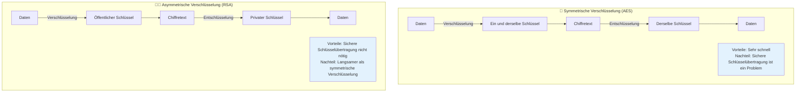

**Praktische Anwendung:** HTTPS verwendet asymmetrische Verschlüsselung für den sicheren Austausch eines symmetrischen Schlüssels und dann symmetrische Verschlüsselung für die schnelle Datenübertragung.

### JWT (JSON Web Token) für Authentifizierung

JWT ist ein Standard zur Erstellung von Zugangs-Token, die für die Benutzerauthentifizierung verwendet werden.

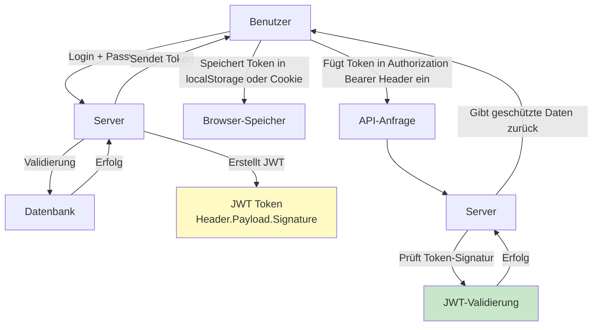

### Cookies vs. Tokens: Vergleich

| Kriterium                      | Cookies (httpOnly)                  | Tokens (JWT)                            |
| ------------------------------ | ----------------------------------- | --------------------------------------- |
| **Speicherung**                | Automatisch im Browser              | localStorage, sessionStorage, Speicher  |
| **Übertragung**                | Automatisch mit jeder Anfrage       | Manuell im Authorization-Header         |
| **Schutz vor XSS**             | ✅ Geschützt (httpOnly)             | ❌ Verwundbar wenn in localStorage      |
| **Schutz vor CSRF**            | ❌ Verwundbar (braucht CSRF-Schutz) | ✅ Geschützt                            |
| **Zustandsverwaltung**         | Server verwaltet Session            | Client verwaltet Token                  |
| **Skalierbarkeit**             | ❌ Benötigt Session-Speicher        | ✅ Stateless, benötigt keinen Speicher  |
| **Arbeit mit anderen Domains** | ❌ Beschränkt auf same-origin       | ✅ Einfach zwischen Domains übertragbar |
| **Größe**                      | ✅ Klein                            | ❌ Größer (enthält Daten)               |

---

## 🚀 Node.js vs Konkurrenten: Deno und Bun (Detaillierter Vergleich) {#comparison}

In den letzten Jahren sind neue JavaScript-Laufzeitumgebungen entstanden, die versuchen, einige Probleme von Node.js zu lösen. Hier ist ein detaillierter technischer Vergleich der drei wichtigsten JavaScript-Runtime-Umgebungen.

---

### 💚 Node.js (2009) - Stabilität und Ökosystem

```mermaid
flowchart TD
    subgraph "🏗️ ARCHITEKTUR NODE.JS"
        V8[V8 JavaScript Engine<br/>🔧 Geschrieben in C++<br/>⚡ Kompilierung zu Maschinencode<br/>🚀 JIT-Optimierung]
        LIBUV[libuv Asynchrone Bibliothek<br/>🔄 Event Loop Verwaltung<br/>📁 Dateisystem I/O<br/>🌐 TCP/UDP Netzwerkoperationen<br/>⏱️ Timer und Signale]
        MODULES[Modulsystem<br/>📦 CommonJS require/module.exports<br/>🆕 ES Modules import/export<br/>📚 NPM Ökosystem]
    end

    subgraph "💪 VORTEILE"
        ECO[Riesiges Ökosystem<br/>📊 1,5+ Millionen NPM-Pakete<br/>🔍 Lösung für jede Aufgabe<br/>👥 Aktive Community]
        STABLE[Stabilität und Zuverlässigkeit<br/>🏢 Enterprise-Einsatz<br/>⏰ 14+ Jahre Entwicklung<br/>🧪 Produktionsgetestet]
        SUPPORT[Breite Unterstützung<br/>☁️ Alle Cloud-Plattformen<br/>🐳 Docker Container<br/>📱 Mobile Entwicklung React Native]
    end

    subgraph "⚠️ NACHTEILE"
        PERF[Performance<br/>🐌 Langsamer App-Start<br/>🔄 Single-threaded Limitierungen<br/>💾 Hoher Speicherverbrauch]
        MODULES_HELL[node_modules Probleme<br/>💿 Dependency-Duplizierung<br/>📁 Riesige Projektgrößen<br/>🔗 Dependency Hell Konflikte]
        SECURITY[Sicherheit<br/>🔓 Vollzugriff auf Dateisystem<br/>🌐 Unbegrenzter Netzwerkzugriff<br/>⚠️ Potenzielle Package-Schwachstellen]
    end

    V8 --> LIBUV
    LIBUV --> MODULES
    ECO --> STABLE
    STABLE --> SUPPORT
    PERF --> MODULES_HELL
    MODULES_HELL --> SECURITY

    style V8 fill:#4caf50,color:#fff
    style LIBUV fill:#66bb6a,color:#fff
    style MODULES fill:#81c784,color:#fff
    style ECO fill:#c8e6c9
    style STABLE fill:#c8e6c9
    style SUPPORT fill:#c8e6c9
    style PERF fill:#ffcdd2
    style MODULES_HELL fill:#ffcdd2
    style SECURITY fill:#ffcdd2
```

---

### 🦕 Deno (2018) - Sicherheit und Eingebaute Werkzeuge

```mermaid
flowchart TD
    subgraph "🏗️ ARCHITEKTUR DENO"
        V8D[V8 JavaScript Engine<br/>🔧 Gleiche Engine wie Node.js<br/>⚡ TypeScript out-of-the-box<br/>🆕 ES Modules nativ]
        TOKIO[Tokio Asynchrone Runtime<br/>🦀 Geschrieben in Rust<br/>⚡ Hochperformant<br/>🔒 Memory-safe Architektur]
        PERMS[Berechtigungssystem<br/>🛡️ Secure by default<br/>🚫 Kein FS-Zugriff ohne Flags<br/>🌐 Beschränkter Netzwerkzugriff]
    end

    subgraph "💪 VORTEILE"
        SECURITY_FIRST[Sicherheit an erster Stelle<br/>🔐 Sandbox-Umgebung<br/>✅ Explizite Berechtigungen --allow-read --allow-net<br/>🛡️ Supply Chain Attack Prevention]
        BUILTIN[Eingebaute Werkzeuge<br/>📝 TypeScript Compiler<br/>🔧 Formatierer und Linter<br/>🧪 Eingebauter Test Runner<br/>📦 Dependency Inspector]
        MODERN[Moderne Standards<br/>🌐 Web APIs fetch/WebSocket<br/>📁 Nur ES Modules<br/>🔗 URL-Importe ohne node_modules]
    end

    subgraph "⚠️ NACHTEILE"
        ECO_SMALL[Kleineres Ökosystem<br/>📦 Weniger Pakete als NPM<br/>🔧 Nicht alle Node.js Pakete kompatibel<br/>👥 Kleinere Entwicklergemeinschaft]
        COMPAT[Kompatibilitätsprobleme<br/>📚 Nicht alle NPM Module funktionieren<br/>🔄 Code-Anpassungen notwendig<br/>⚡ Langsamer als Bun]
        LEARN[Lernkurve<br/>🆕 Neue Entwicklungsphilosophie<br/>🔧 Anderer Ansatz für Module<br/>⚙️ Workflow-Änderungen]
    end

    V8D --> TOKIO
    TOKIO --> PERMS
    SECURITY_FIRST --> BUILTIN
    BUILTIN --> MODERN
    ECO_SMALL --> COMPAT
    COMPAT --> LEARN

    style V8D fill:#00bcd4,color:#fff
    style TOKIO fill:#26c6da,color:#fff
    style PERMS fill:#4dd0e1,color:#fff
    style SECURITY_FIRST fill:#b2ebf2
    style BUILTIN fill:#b2ebf2
    style MODERN fill:#b2ebf2
    style ECO_SMALL fill:#ffcdd2
    style COMPAT fill:#ffcdd2
    style LEARN fill:#ffcdd2
```

---

### 🍞 Bun (2022) - Maximale Geschwindigkeit und Alles-in-einem

```mermaid
flowchart TD
    subgraph "🏗️ ARCHITEKTUR BUN"
        JSC[JavaScriptCore Engine<br/>🍎 Safari WebKit Engine<br/>⚡ Geschwindigkeitsoptimiert<br/>🚀 Schneller als V8 in bestimmten Aufgaben]
        ZIG[Zig Systemprogrammierung<br/>⚡ Low-Level Performance<br/>💾 Speicherverwaltung<br/>🔧 Native System-Integration]
        TRANSPILER[Eingebauter Transpiler<br/>📝 TypeScript JSX out-of-the-box<br/>🔄 Hot Reload Entwicklung<br/>📦 Bundling ohne Webpack]
    end

    subgraph "💪 VORTEILE"
        SPEED[Phänomenale Geschwindigkeit<br/>🚀 4x schnellerer Start als Node.js<br/>⚡ 20x schnellere Paketinstallation als npm<br/>📦 Eingebauter Bundler schneller als Webpack<br/>🧪 100x schnellere Testausführung als Jest]
        ALL_IN_ONE[Alles in einem Werkzeug<br/>🏃 Runtime Ausführungsumgebung<br/>📦 Package Manager npm-Alternative<br/>⚡ Bundler Webpack/Vite Ersatz<br/>🧪 Test Runner Jest-Alternative<br/>📝 Transpiler TypeScript/JSX]
        COMPAT[Vollständige Kompatibilität<br/>📚 100% Node.js API Support<br/>📦 NPM-Pakete funktionieren ohne Änderungen<br/>🌐 Web APIs eingebaute Unterstützung<br/>🔗 Drop-in Replacement für Node.js]
    end

    subgraph "⚠️ NACHTEILE"
        YOUNG[Jugend des Projekts<br/>🐛 Mögliche Bugs und Instabilität<br/>📅 Aktive Entwicklung API-Änderungen<br/>🏢 Nicht empfohlen für kritische Systeme]
        WINDOWS[Begrenzte Windows-Unterstützung<br/>🪟 Experimentelle Unterstützung<br/>🔧 Nicht alle Features funktionieren<br/>🐛 Mehr Bugs unter Windows]
        COMMUNITY[Kleine Gemeinschaft<br/>👥 Weniger Dokumentation<br/>🔍 Few fertige Lösungen<br/>❓ Schwieriger Hilfe zu finden]
    end

    JSC --> ZIG
    ZIG --> TRANSPILER
    SPEED --> ALL_IN_ONE
    ALL_IN_ONE --> COMPAT
    YOUNG --> WINDOWS
    WINDOWS --> COMMUNITY

    style JSC fill:#f57c00,color:#fff
    style ZIG fill:#ff9800,color:#fff
    style TRANSPILER fill:#ffb74d,color:#fff
    style SPEED fill:#fff3e0
    style ALL_IN_ONE fill:#fff3e0
    style COMPAT fill:#fff3e0
    style YOUNG fill:#ffcdd2
    style WINDOWS fill:#ffcdd2
    style COMMUNITY fill:#ffcdd2
```

---

### 📊 Performance-Vergleichstabelle

| Metrik                | 💚 Node.js       | 🦕 Deno        | 🍞 Bun            |
| --------------------- | ---------------- | -------------- | ----------------- |
| **Startzeit**         | ~100ms           | ~80ms          | ~25ms             |
| **Paketinstallation** | npm install: 10s | deno cache: 8s | bun install: 0.5s |
| **Bundling**          | Webpack: 30s     | esbuild: 5s    | eingebaut: 2s     |
| **Test-Ausführung**   | Jest: 15s        | eingebaut: 8s  | eingebaut: 0.15s  |
| **HTTP requests/sec** | 50.000           | 65.000         | 100.000+          |
| **Speicherverbrauch** | 50MB             | 35MB           | 25MB              |

### 🎯 Empfehlungen zur Auswahl

#### Wählen Sie **Node.js** wenn:

- 🏢 Sie Enterprise-Anwendungen entwickeln
- 📦 Sie das maximale Paket-Ökosystem benötigen
- 👥 Community-Support wichtig ist
- ⚖️ Stabilität wichtiger als Performance ist

#### Wählen Sie **Deno** wenn:

- 🔒 Sicherheit kritisch wichtig ist
- 📝 Sie TypeScript als Hauptsprache verwenden
- 🛠️ Sie eingebaute Werkzeuge bevorzugen
- 🌐 Sie Webanwendungen mit modernen Standards entwickeln

#### Wählen Sie **Bun** wenn:

- ⚡ Entwicklungsgeschwindigkeit kritisch wichtig ist
- 🧪 Sie intensiv testen
- 🔄 Sie schnelle Builds und Hot Reload brauchen
- 📦 Sie eine Alles-in-einem-Lösung für die Entwicklung wollen

---

## 🧪 Testen von Node.js-Anwendungen {#testing}

Testen ist ein Schlüsselaspekt bei der Entwicklung zuverlässiger Anwendungen. Im Node.js-Ökosystem gibt es verschiedene Ansätze und Werkzeuge.

### Werkzeuge für API-Tests

#### Konsolen-Utilities (cURL, wget)

Einfacher Weg für schnelle, einzelne API-Prüfungen direkt vom Terminal.

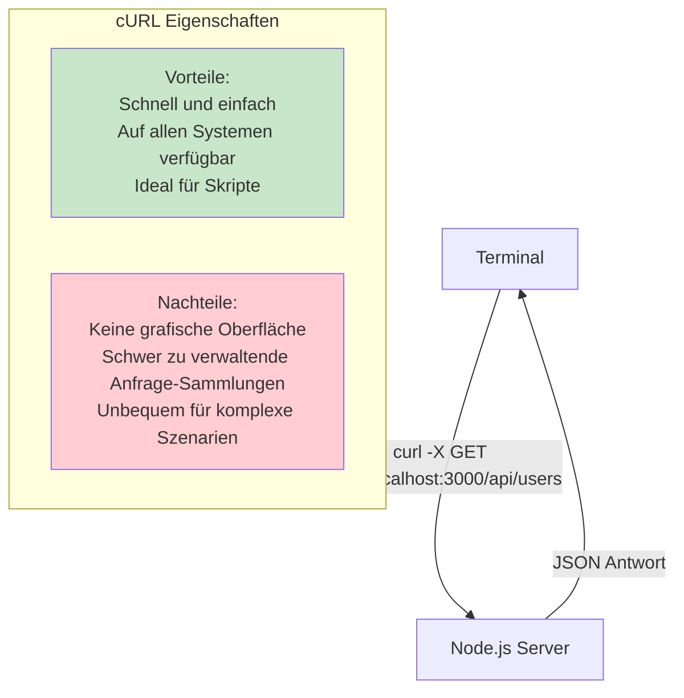

#### Postman / Insomnia

Mächtige grafische Clients für API-Tests. Ermöglichen das Erstellen von Anfrage-Sammlungen, die Verwendung von Umgebungsvariablen und das Schreiben von Tests in JavaScript.

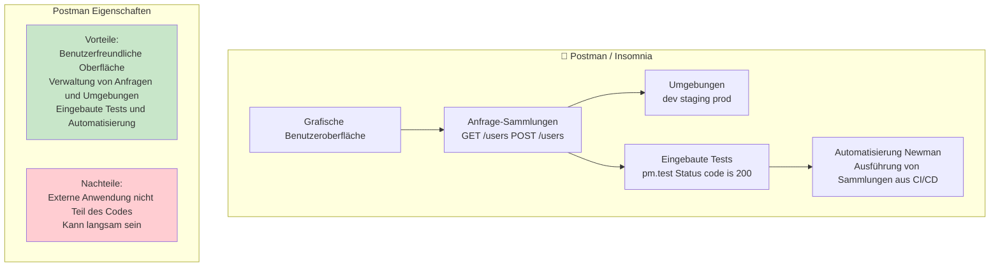

### Frameworks für automatisierte Tests

#### Jest

Das beliebteste Framework für JavaScript-Tests. "Alles in einem": Test-Runner, Assertion-Bibliothek und Mocks.

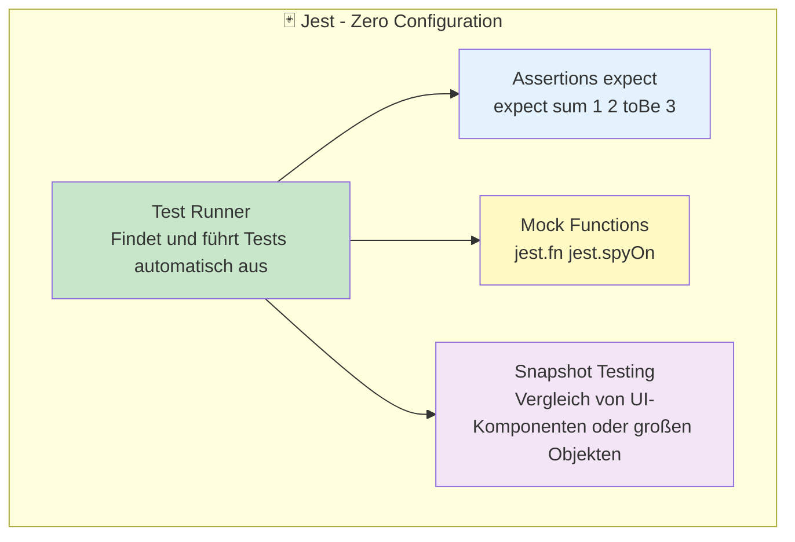

---

## 🌟 Was gibt Node.js den Entwicklern? {#benefits}

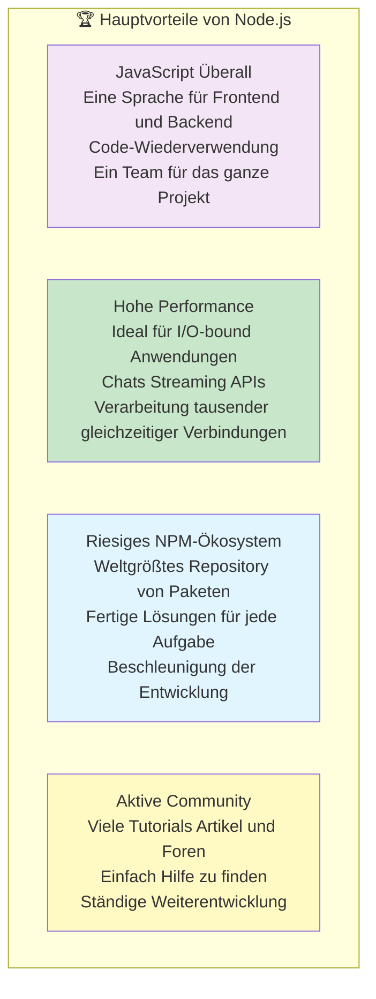

**Hauptkonzepte, die man für die Arbeit mit Node.js kennen sollte:**

1. **Asynchronität:** Verstehen von Callbacks, Promises und Async/Await.
2. **Event Loop:** Wissen, wie sie funktioniert, um sie nicht zu blockieren.
3. **Module:** Arbeiten können mit CommonJS (require) und ES Modules (import).
4. **NPM:** Abhängigkeiten über package.json verwalten.
5. **Streams:** Effizient mit großen Datenmengen arbeiten.
6. **EventEmitter:** Eigene Ereignisse erstellen.

---

## 📚 Praktische Anwendung der Konzepte: Unsere Demos

In unserem Projekt haben wir verschiedene Demos erstellt, die diese Konzepte in der Praxis zeigen:

### 1. Events & EventEmitter Demo ([`demos/events-demo.js`](demos/events-demo.js:1))
Diese Demo zeigt, wie man mit dem Event-System von Node.js arbeitet. Wir erstellen einen Chat-Raum, der Ereignisse wie Benutzerbeitritt, Nachrichtenversand und Fehlerbehandlung auslöst. Dies demonstriert das Observer-Pattern und asynchrone Verarbeitung.

**Was wir sehen:**
- Im Terminal: Simulation eines Chatraums mit EventEmitter.
- Aktionen wie Benutzerbeitritt, Nachrichtenversand, Fehler werden als Events geloggt.

**Wichtige Technologien sichtbar:**
- Event-basierte Architektur
- Event Loop Prinzip
- Asynchrone Verarbeitung

### 2. File System Demo ([`demos/fs-demo.js`](demos/fs-demo.js:1))
Diese Demo zeigt verschiedene Arten, mit Dateien zu arbeiten: synchron, asynchron mit Callbacks und mit Promises. Sie demonstriert auch Fehlerbehandlung und Dateisystemoperationen.

**Was wir sehen:**
- Im Terminal: Lesen und Erstellen von Dateien.
- Ausgabe von Dateinamen, Versionen und Erfolgsmeldungen.

**Wichtige Technologien sichtbar:**
- Asynchrone und synchrone Dateioperationen
- Fehlerbehandlung
- Callbacks und Promises

### 3. HTTP Demo Server ([`demos/http-demo.js`](demos/http-demo.js:1))
Ein reiner Node.js HTTP-Server ohne Framework, der verschiedene Endpunkte bereitstellt. Zeigt grundlegende HTTP-Serverfunktionen und wie man ohne Express.js arbeitet.

**Was wir sehen:**
- Ein HTTP-Server auf Port 3001 mit verschiedenen Endpunkten: Hauptseite, Serverinfo, Zeit, Header-Analyse, Zufallsdaten, 404-Seite.
- Serverstatistiken wie Anzahl Anfragen, Speicherverbrauch und Laufzeit.

**Wichtige Technologien sichtbar:**
- HTTP-Protokoll
- Event Loop
- Asynchrone Verarbeitung
- Request/Response Zyklus
- Routing
