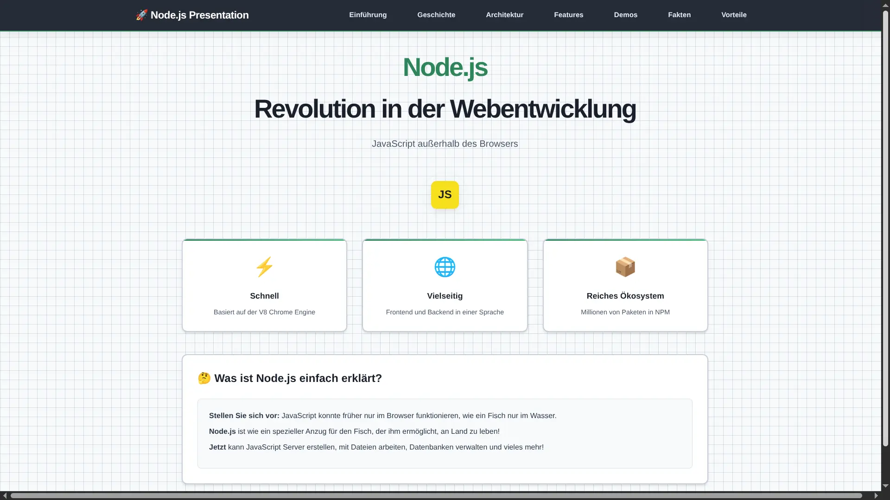
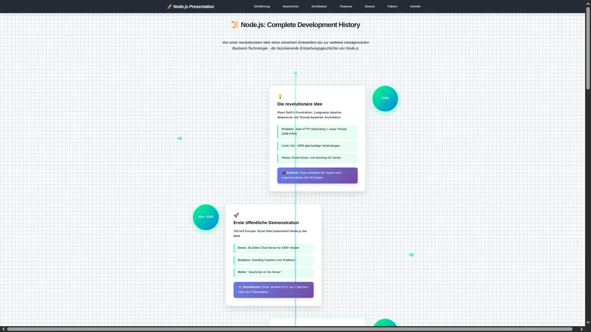
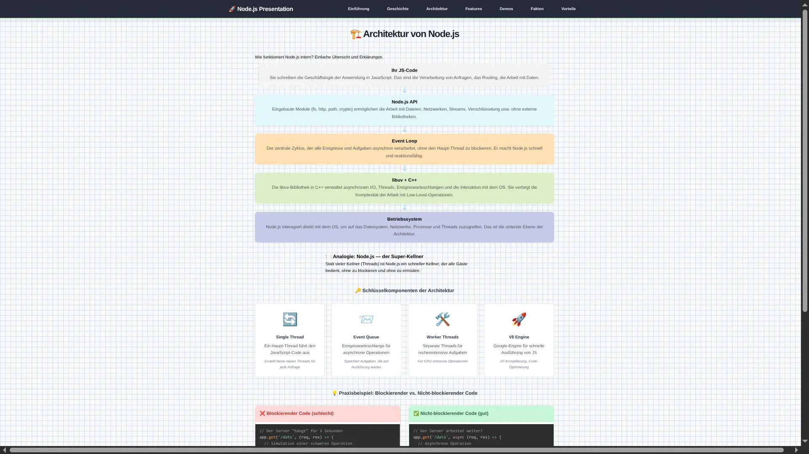
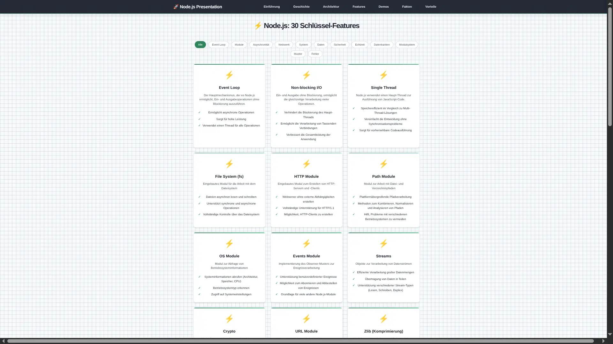
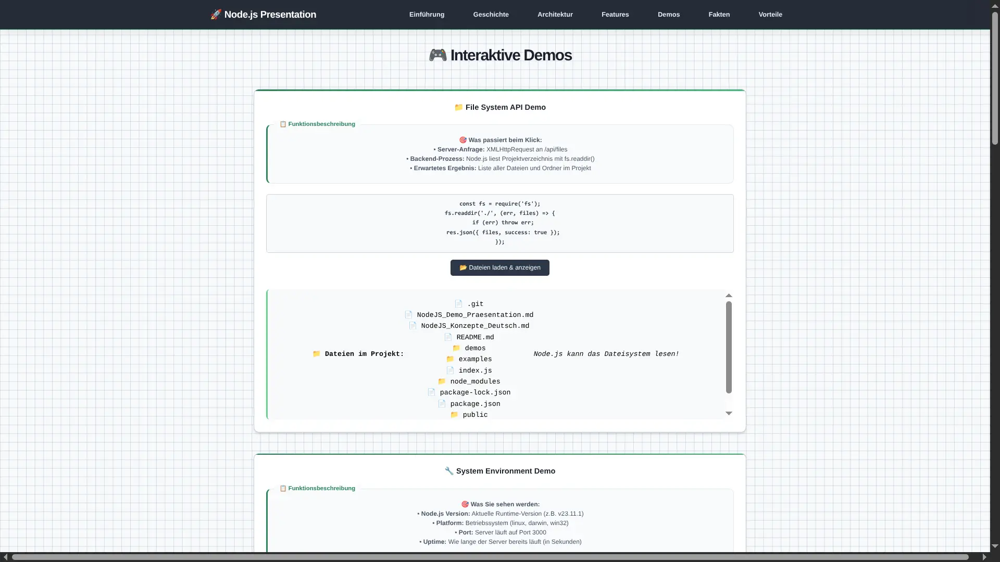
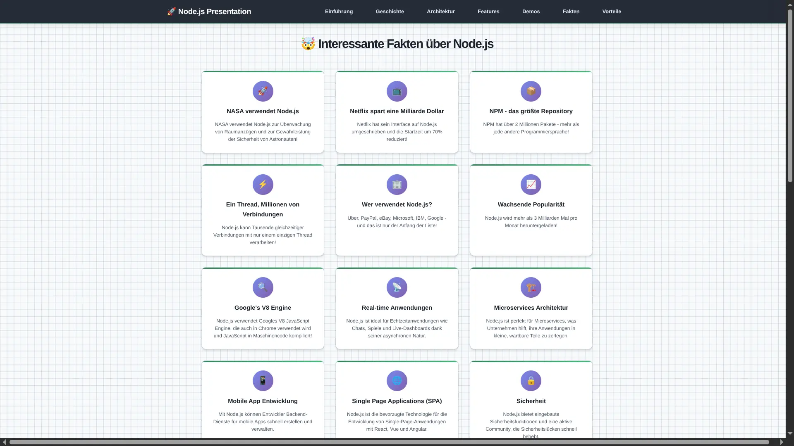
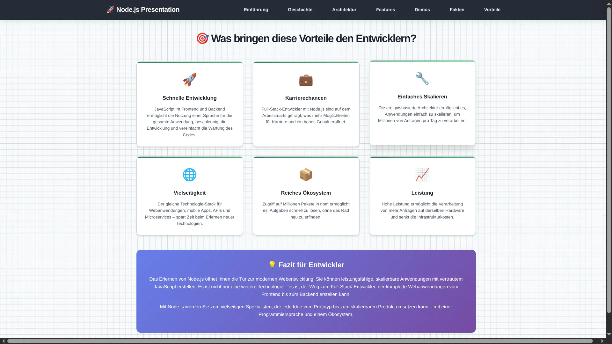

# Node.js Interaktive Präsentation

> Interaktive Präsentation über Node.js zum Erlernen der Grundlagen der Webentwicklung

## Beschreibung

Dieses Projekt ist eine interaktive Web-Präsentation, die die Grundlagen von Node.js mit einfachen Worten und praktischen Beispielen erklärt. Perfekt geeignet für Studenten, die verstehen möchten, was Node.js ist und wofür es benötigt wird.

## Screenshots

### Einführung


### Geschichte


### Features


### Architektur


### Demos


### API Endpunkte


### Vergleich


## Was ist enthalten

### Theoretische Abschnitte:

- **Einführung**: Was ist Node.js einfach erklärt
- **Geschichte**: Wie und warum Node.js entwickelt wurde
- **30 Features**: Wichtige Node.js Eigenschaften nach Kategorien filterbar
- **Architektur**: Event Loop und Hauptkomponenten
- **Interessante Fakten**: Wo Node.js verwendet wird
- **Vergleich**: Node.js vs PHP vs Python

### Praktische Demos:

- **File System**: Arbeiten mit Dateien und Ordnern
- **Events**: Ereignissystem mit EventEmitter
- **HTTP Server**: Erstellen von Webservern (reines Node.js)
- **Environment**: Umgebungsvariablen und Systeminformationen
- **Express.js**: CRUD-Operationen, Routing und Middleware

### Interaktive Möglichkeiten:

- Chat über REST API (Nachrichten senden und abrufen)
- Dateierstellung über Web-Interface
- Anzeige von Systeminformationen
- Live-Server-Statistiken

## Projektstruktur

```
Referat_NodeJS/
├── index.js              # Haupt-Express-Server
├── package.json          # Abhängigkeiten und Skripte
├── README.md             # Diese Datei
├── NodeJS_Demo_Praesentation.md   # Demo-Dokumentation (Deutsch)
├── NodeJS_Konzepte_Deutsch.md     # Theoretische Konzepte (Deutsch)
├── public/               # Web-Interface
│   ├── index.html        # Hauptseite der Präsentation
│   ├── styles.css        # Design-Stile
│   └── script.js         # Interaktivität
├── demos/                # Demo-Skripte (CLI)
│   ├── fs-demo.js        # Dateisystem-Beispiele
│   ├── events-demo.js    # Events-Beispiele
│   └── http-demo.js      # HTTP-Server-Beispiele
├── examples/             # Erstellte Dateien (wird generiert)
└── screenshots/          # Projekt-Screenshots (WebP)
```

## Features

### Interaktivität:

- **Navigation**: Wechseln zwischen Abschnitten per SPA
- **Live-Beispiele**: Code direkt im Browser ausführen
- **Chat**: Nachrichten über die Node.js API senden
- **Dateien**: Dateien über das Web-Formular erstellen

### Pädagogischer Ansatz:

- **Einfache Erklärungen**: Komplexe Konzepte einfach erklärt
- **Analogien**: Verständliche Vergleiche aus dem Alltag
- **Visualisierung**: Diagramme und Schaubilder
- **Praxis**: Reale Codebeispiele

### Modernes Design:

- **Responsiv**: Funktioniert auf allen Geräten
- **Animationen**: Farbverläufe und Übergänge
- **Benutzerfreundlich**: Intuitive Navigation

## Technologien

### Backend (Node.js):

- **Express.js v5** - Web-Framework
- **cors** - Cross-Origin-Anfragen
- **dotenv** - Umgebungsvariablen
- **Node.js Built-in Module**: fs, path, http, events, url, crypto

### Frontend:

- **HTML5** - Markup
- **CSS3** - Styles und Animationen (CSS Custom Properties)
- **JavaScript ES6+** - Interaktivität
- **XMLHttpRequest** - Serveranfragen (eigene Wrapper-Funktion)
- **Prism.js** - Syntax-Highlighting fuer Code-Blöcke

## API Endpunkte

```
GET    /                         # Hauptseite (Präsentation)
GET    /api/files                # Projektdateien auflisten
GET    /api/env                  # Systeminformationen
GET    /api/messages             # Chat-Nachrichten abrufen
POST   /api/messages             # Chat-Nachricht senden
POST   /api/write-file           # Datei erstellen
GET    /api/users                # Alle Benutzer abrufen
GET    /api/users/:id            # Einzelnen Benutzer abrufen
POST   /api/users                # Neuen Benutzer erstellen
PUT    /api/users/:id            # Benutzer aktualisieren
DELETE /api/users/:id            # Benutzer löschen
GET    /api/stats                # Serverstatistiken
POST   /api/reset-stats          # Statistiken zurücksetzen
GET    /api/process              # Prozessinformationen
GET    /api/demo/routing         # Express.js Routing Demo
POST   /api/demo/routing         # Express.js Routing Demo (POST)
GET    /api/middleware-demo       # Middleware-Kette Demo
GET    /api/health               # Health Check
GET    /api/installation-guide   # Node.js Installationsanleitung
GET    /api/popular-packages     # Beliebte NPM-Pakete
```

## Nutzung für Lernzwecke

### Für Lehrende:

1. Starten Sie `npm start` und öffnen Sie die Präsentation
2. Führen Sie die Studierenden durch alle Abschnitte
3. Zeigen Sie Live-Demos und Codebeispiele
4. Lassen Sie die Studierenden die interaktiven Funktionen ausprobieren

### Für Studierende:

1. Studieren Sie die theoretischen Abschnitte
2. Starten Sie die Demo-Skripte: `npm run demo:fs`, `npm run demo:events`, `npm run demo:http`
3. Experimentieren Sie mit Chat und Dateierstellung
4. Studieren Sie den Quellcode in den Ordnern `public/` und `demos/`

## Interessante Fakten aus der Präsentation

- NASA verwendet Node.js für Weltraummissionen
- Netflix hat dank Node.js eine Milliarde Dollar gespart
- NPM ist das größte Paket-Repository der Welt
- Ein Thread kann Tausende Verbindungen verarbeiten
- Node.js wird 3+ Milliarden Mal pro Monat heruntergeladen

## Lernziele

Nach dem Studium dieser Präsentation verstehen die Studierenden:

- Was Node.js ist und wofür es gebraucht wird
- Wie der Event Loop funktioniert
- Die wichtigsten Module: fs, http, events
- Wie man einen einfachen Webserver erstellt
- Vorteile von Node.js gegenüber anderen Technologien
- Wo und wie Node.js in der Praxis eingesetzt wird

## Support

Wenn Fragen oder Probleme auftreten:

1. Prüfen Sie, ob Node.js installiert ist (Version 14+)
2. Stellen Sie sicher, dass Port 3000 frei ist
3. Installieren Sie die Abhängigkeiten: `npm install`
4. Starten Sie den Server neu: `npm start`

## Lizenz

ISC - Frei verwendbar für Bildungszwecke!

---

**Fuer das Lernen von Node.js gemacht**

_Denken Sie daran: Der beste Weg, Node.js zu lernen, ist Praxis! Experimentieren Sie mit dem Code und erstellen Sie Ihre eigenen Projekte!_
